## Introduction

**Ex** is an common widget / utils or helper library i made for all type application. whatever application you made, **Ex** it will help you reduce your fucking time on development process

# Feature

### 🟩 Widgets ExComponent

| component                | screenshot               |
| -----------------        | ---------------------    |
| ExButtonDefault          | 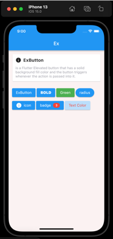      |
| ExButtonOutline          | 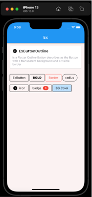  |
| ExAvatarView             |   |
| ExImageView              |   |
| ExDashLine               | 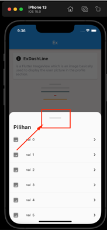  |
| ExProgressIndicator      | 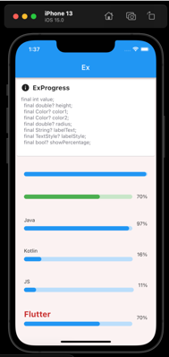  |
| ExTextField              | 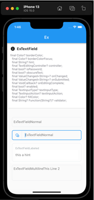  |
| ExUiLoading              | 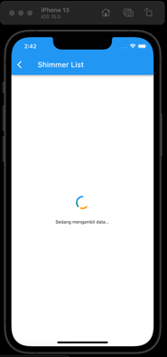|
| ExUiErrorOrEmpty         | 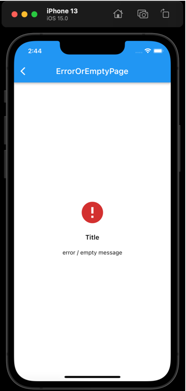|
| ExUiShimmerList          | |
| ExUiShimmerGrid          | |


> and many more component .. let explore 😎!

### 🟩 ExAlert
an simple way to display alert dialogs such as 
there have **4 type** : `success`, `error`, `warning`, `confirm`


```dart
// example
ExAlert.success(
    context: context!,
    showAsset: true,
    title: 'Success',
    titleTextSize: 18,
    titleTextAlign: TextAlign.center,
    titleTextColor: Colors.black,
    message: '',
    messageTextSize: 13,
    messageTextAlign: TextAlign.center,
    messageTextColor: Colors.blueGrey,
    isDismissible: false,
    btnOkText: 'Close',
    barrierColor: Colors.black54,
    cornerRadius: 8.0,
);
```
> **and feel free to customize**

### 🟩 ExLoading
An elegant Flutter Dialog solution, Easily implement Loading Make the use of the dialog easier!

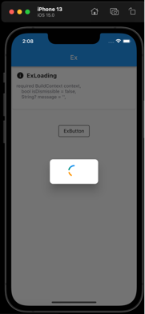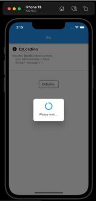

```dart
// example
ExLoading.show(
    context: context!,
    message: 'Please wait ...',
    isDismissible: false,
);
Future.delayed(3.seconds).then((value) => ExLoading.dismiss(context!));
```

### 🟩 ExSnackbar
A flexible widget for user notification. Customize your text, button, duration, animations and much more. For Android devs, it is made to replace Snackbars and Toasts.
there **have 5 type** : `info`, `success`, `error`, `action`, `upload`

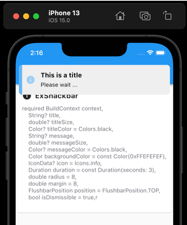
```dart
// example
ExSnackbar.info(
  context: context!,
  title: 'This is a title',
  message: 'Please wait ...',
  isDismissible: false,
);
```
> **and feel free to customize**

### 🟩 ExBottomSheet
Flexible bottom sheet with the ability to scroll content even without a list.
there **have 4 type** : `list`, `grid`, `input`, `custom`

```dart
// example 1

// dummy data
final _data = <KeyVal>[];
10.forEach((index) {
  _data.add(KeyVal(key: 'key$index', val: 'val  $index'));
});

// show ExBottomSheet : TYPE LIST
ExBottomSheet.list(
    context: context!,
    title: 'Select Your Type',
    data: _data,
    callback: (k, v) async {
        Get.back();
        ExSnackbar.uploading(context: context!, message: 'message');
    },
);
```

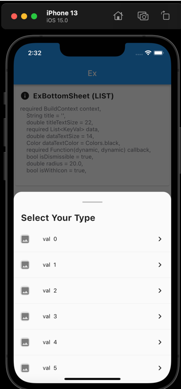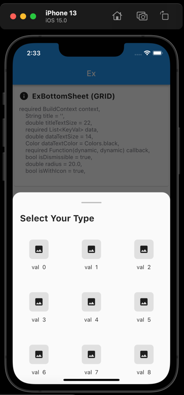

### 🟩 ExLog
Small, easy to use and extensible logger which prints beautiful logs.

### 🟩 ExUtil
Useful String extensions to save you time in production. Feel free to contribute with PR.

### 🟩 Extension
>explore here : https://github.com/abehbatre/ex/tree/master/lib/src/extensions

### 🟩 Scope Function & Control Flow
helper library that provides readable methods with which you can write cleaner looking code.

#### is a helper library that provides the following concepts:

Writing "cleaner" code by adding readable control-flow methods that are able to replace the standard Dart control-flow statements. See Control flow for more information.
Adds extension methods to existing Dart types for better and easier data manipulation. See Data manipulation for more information.
Provides methods to easily create data sets of certain types.

### Common Usage ###

#### let 
Often used for executing a code block only with non-null values.
```dart
someNullable?.let((it) { ... });
```

#### also
Used for additional actions that don't alter the object, such as logging or printing debug information.
```dart
something.also((it) { ... }); // returns something.
```

#### run
Used for additional actions that don't alter the object, such as logging or printing debug information.
```dart
someNullable ?? run(() {
    var defaultValue = ......;
    // several process...
    return defaultValue;
});
```


#### if-statement as expressions
The iff method works like the if statement, but with the added bonus of being able to write them as expressions. You can use them to replace complex ternary operators with a readable if-like statement:
```dart
final x = iff(a < b, () {
    return a;
}).elseIf(a == b, () {
    return 0;
}).orElse(() {
    return b;
});
```

#### try-statement as expressions
The `tryy` method works like the tryy statement, but with the added bonus of being able to write them as expressions. Allowing you to catch multiple exceptions and depending on those exceptions return different values:
```dart
final x = tryy(() {
  return aMethodThatCouldFail();
}, catches: {
  On<SomeException>: () {
    return 1;
  },
  On<OtherException>: () {
    return 2;
  }
});
```
#### when-statements as expressions
The `when` method replaces the switch statement. And can be used to write expressions:
```dart
final result = when(place, {
  1: () => CompetitionPlace.first,
  2: () => CompetitionPlace.second,
  3: () => CompetitionPlace.third,
  [4,5]: () => CompetitionPlace.honourableMentions,
}).orElse(() => CompetitionPlace.others);
```


---